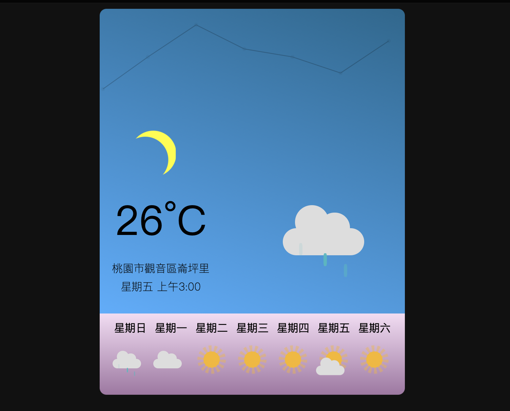
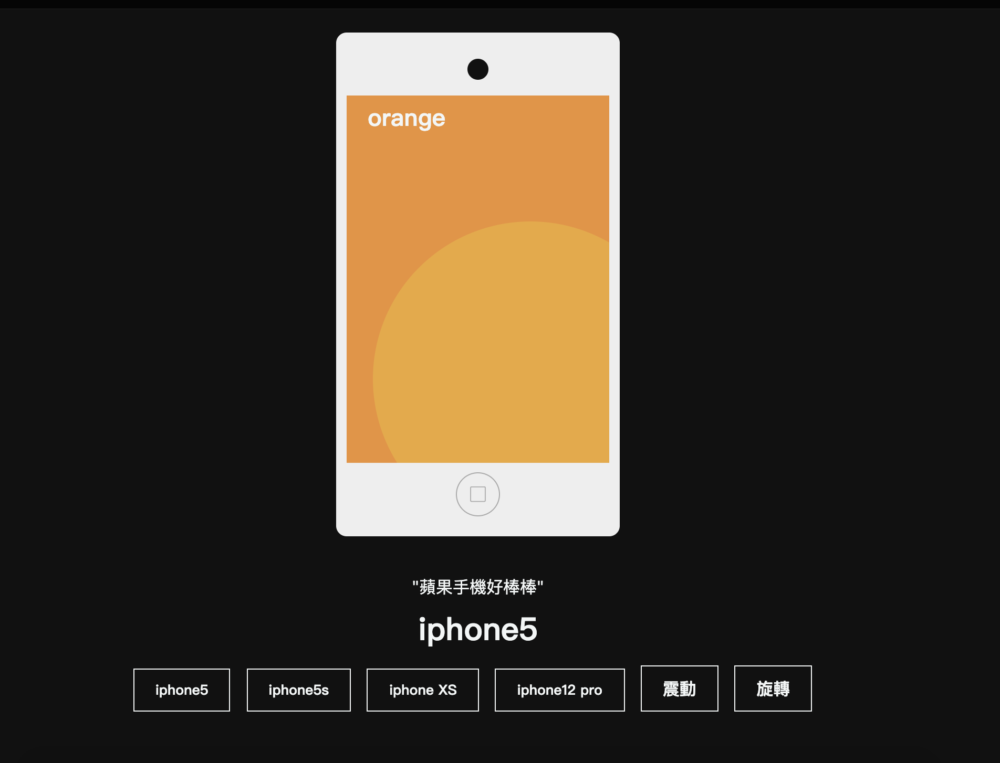
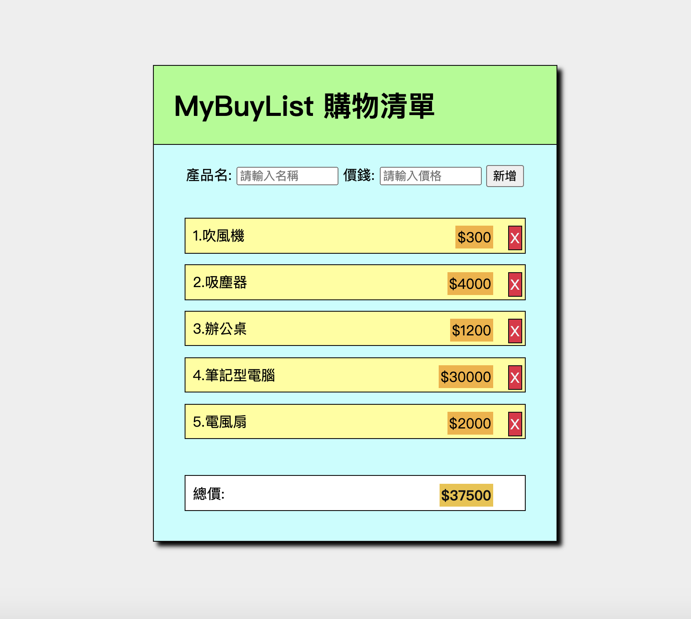
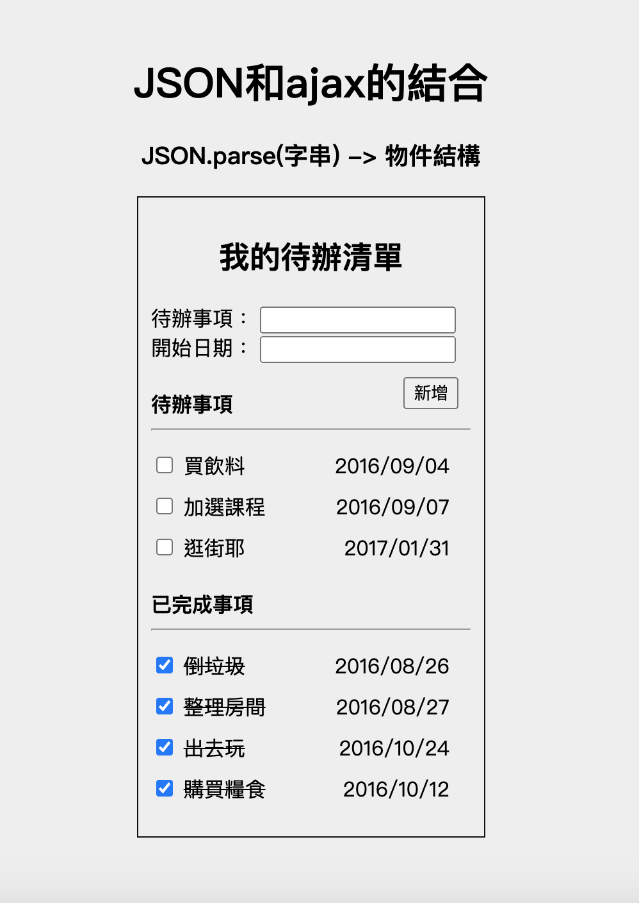
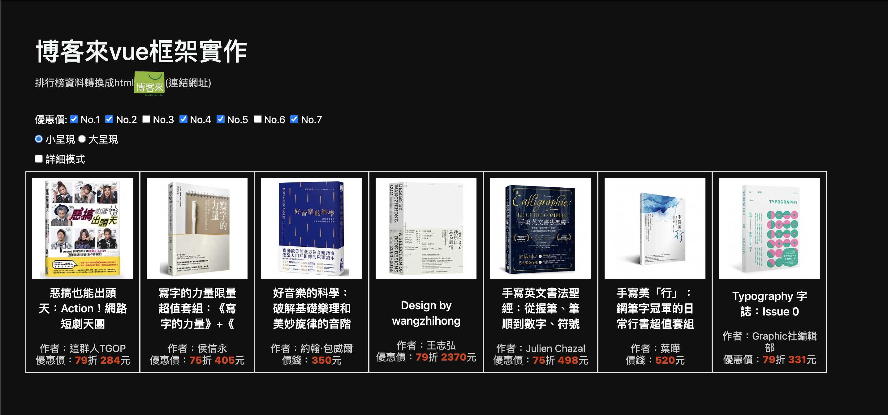
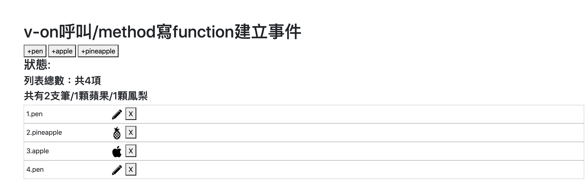
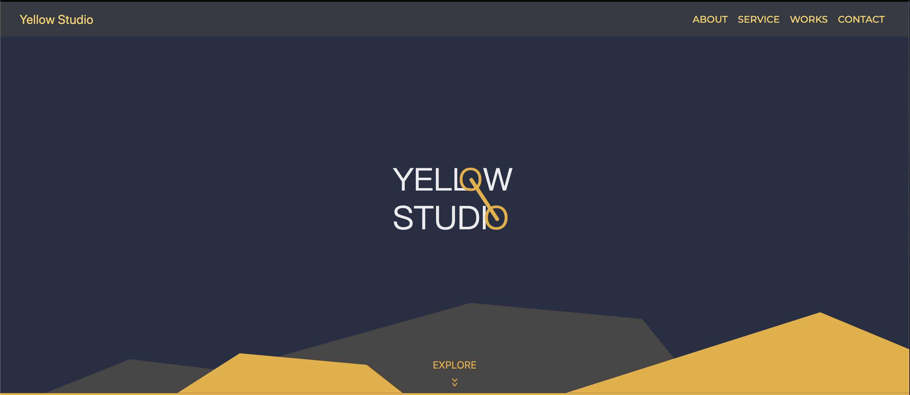

# 網頁作品集(共22個)

裡頭中的作品集是從線上教學網站hahow中的「動畫互動網頁程式入門」(HTML/CSS/JS)每章課程學習而來，增加自身對html、css、js的基礎能力。

以下都是靜態網站，無後端存取數據的作用，欲瀏覽各作品網頁：

## ------ 基礎html, css操作-------

### 1.名片：
  介紹：運用基礎html, css來編制個人名片。
  
  連結：https://sfad159357.github.io/based_webpage/1.名片/
  
### 2.個人履歷：
  介紹：運用基礎html, css來編制個人履歷。
  
  連結：https://sfad159357.github.io/based_webpage/2.個人履歷/

### 3.色塊模組：
  介紹：在設計網頁前，有字體大小、配色作為網站設計樣式。
  
  連結：https://sfad159357.github.io/based_webpage/3.色塊模組/
  
### 4.hover動畫：
  介紹：使用css的hover，當滑鼠移上去更改css樣式。
  
  連結：https://sfad159357.github.io/based_webpage/4.hover動畫/
  
### 5.keyframe動畫：
  介紹：使用css的@keyframes，製作五種不同方格的動畫。
  
  連結：https://sfad159357.github.io/based_webpage/5.keyframe動畫/
  
### 6.SVG動圖：
  介紹：使用html的svg向量元素製作5種不同的svg動畫，最後一張圖是需要滑鼠移上去才會顯示。
  
  連結：https://sfad159357.github.io/based_webpage/6.SVG動圖/
  
## ------ 使用jade, sass預處理器 -------

### 7.天氣盒子：
  介紹：運用上述hover, keyframes, svg技巧來製作出如同手機的天氣app樣式。滑鼠移至介面上，會滑出一週天氣顯示；點擊介面，會顯示溫度折線圖。
  
  網頁圖片:
  
  連結：https://sfad159357.github.io/based_webpage/7.天氣盒子/
 
## ------ 載入jQuery -------

### 8.計數器：
  介紹：在html的script引入jQuery CDN，然後存取DOM文件中.num元素節點，針對其元素內的數字增減進行if else判斷，來改變底下訊息css樣式。
  
  
  連結：https://sfad159357.github.io/based_webpage/8.計數器/
 
### 9.手機展示：
  介紹：可點選不同的按鈕，觸發jQuery綁定DOM元素的函式，形成不同手機css變化的效果。
  
  特色：<ol> 1.透過點擊存取不同button中自製的屬性(data-width,data-height)，來改變手機css寬、高樣式。</ol>
       <ol> 2.可以點擊其他右下震動、旋轉按鈕，透過存取手機節點改變其css，製造出動畫的效果。</ol>
       <ol> 3.點擊手機螢幕可以使螢幕滑動，按首頁按鈕會跳回第一頁。</ol>
       <ol> 4.點擊按鈕都帶有音效。</ol>
       
  網頁圖片:
  
  連結：https://sfad159357.github.io/based_webpage/9.手機展示/
  
### 10.購物清單：
  介紹：使用json物件建立採買清單，透過點擊「新增」按鈕，存取「產品名」及「價格」兩欄的值，並push到採買清單物件中的列表。
  
  特色：<ol>1.使用template string，來作為可帶入變數的string格式。</ol>
       <ol>2.刪除清單項目，使用splice來裁切項目。</ol>
       
  網頁圖片:
       
  連結：https://sfad159357.github.io/based_webpage/10.購物清單/
  
### 11.待辦清單：
  介紹：學習利用jQuery的ajax載入外部資源，網頁打開能直接呈現待辦事項，可以新增和刪除事項。勾選做完，會該事項會跑到已完成事項。
  
  特色：<ol>1.比起直接建立json物件，這次利用jQuery中的$.ajax來請求外部網頁的json格式的data。</ol>
       <ol>2.新增項目物件之屬性"done"，其值為boolean值，給予項目是否被完成的狀態。</ol>
       <ol>3.透過checkbox的點擊，針對done屬性給予反向條件，再次呼叫清單列表getList()。</ol>
       
  網頁圖片：

  連結：https://sfad159357.github.io/based_webpage/11.待辦清單/
 
## ------- 以下都有用到RWD的功能 ---------

### 12.RWD臉書排版：
  介紹：當螢幕寬度縮小至400px以下，大頭貼會從左側移動到螢幕中間位置。
  
  連結：https://sfad159357.github.io/based_webpage/12.RWD臉書排版/
  
## ------ 引入bootstrap網頁樣板 -----------
  
### 13.RWD隔線系統：
  介紹：透過bootstrap內建的格線樣板，.col-lg/md/sm-/1~12如此依照網頁寬度大小來排版。
  
  連結：https://sfad159357.github.io/based_webpage/13.RWD格線系統/
  
### 14.格線圖形排版：
  介紹：利用bootstrap格線樣板將圖形排版。
  
  連結：https://sfad159357.github.io/based_webpage/14.格線圖形排版/
  
### 15.RWD網頁排版：
  介紹：1.利用bootstrap格線及導航列樣板來排版。
  
  特色：2.載入skrollr CDN，滾動時，標題會有緩慢移動及圖片縮放的效果。
       
  連結：https://sfad159357.github.io/based_webpage/15.RWD網頁排版/
 
## -------- 以下使用Vue框架 -------------

### 16.vue隨手練：
  介紹：隨手操作vue框架功能。
  
  連結：https://sfad159357.github.io/based_webpage/16.vue隨手練/
   
### 17.v-if:
  介紹：使用vue引擎，在html使用v-for迴圈、v-if條件顯示、v-model布林值切換來呈現博客來頁面。
  
  特色：<ol>1.可勾選頁面上第幾本書，經過多少優惠折價後的優惠價格。</ol>
       <ol>2.可勾選頁面上的大小呈現，來決定網頁呈現的排版。</ol>
       <ol>3.可勾選頁面上的詳細模式，決定是否要揭露更多書本資訊。</ol>
   
  網頁圖片：
  
  連結：https://sfad159357.github.io/based_webpage/17.v-if/mode博客來
   
### 18.v-on呼叫：
  介紹：透過vue的v-on來呼叫在vue引擎中所定義的method，進行參數的帶入，而新增或刪除data內的列表或物件資料。
  
  特色：1.點擊按鈕帶入參數，修改原始data，可以將版面進行即時動態更新。
       2.可以進行新增指定項目或針對某列的項目進行刪除。
       3.狀態同時顯示你做了哪個指令。
       4.同時顯示計算所有項目的總數，和分別計算各種項目的數量。
  
  網頁圖片：
  
  連結：https://sfad159357.github.io/based_webpage/18.v-on呼叫/
   
### 19.vue-http:
  介紹：之前載入外部資源是使用jQuery的ajax，這次採用載入vue-resource的CDN，透過vue引擎的$http中的http method，來載入外部資源。
  
  連結：https://sfad159357.github.io/based_webpage/19.vue-http/
   
### 20.vue建立hahow網站：
  介紹：透過vue引擎中的v-bind及method來自動帶入data，並加以設計。
  
  特色：<ol>1.透過vue-resource的$http存取外部資源，將data存在classes物件，再用v-for一一取出。</ol>
       <ol>2.為了讓課程背景圖片的url或是其他原始參數是動態載入，使用v-bind。</ol>
       <ol>3.由於參數會帶入字串內或計算，透過method來包裝程式碼，然後得到回傳值。</ol>
       <ol>4.使用日期格式的相減，轉換成整數型態來呈現。</ol>
  
  網頁圖片：

  連結：https://sfad159357.github.io/based_webpage/20.vue建立hahow網站/
  
### 21.網頁製作：
  介紹：沒有使用vue框架，單純用jQuery和bootstrap來存取DOM元素以及RWD排版。
  
  特色：<ol>1.導航列點選網頁區塊section，可以滑順地滾動，而非瞬間跳動。</ol>
       <ol>2.首頁閃爍的explore字樣，一旦開始頁面捲動，會見便消失。</ol>
       <ol>3.在"About"區塊內，存取window的滑鼠移動事件，一旦滑鼠移動，會有白色叉叉隨著滑鼠移動。</ol>
       <ol>4.在"About"區塊內，透過計算鼠標離頁面的距離，右下角的貓的圖片會隨之變換。</ol>
       <ol>5.除了採用bootstrap的格線排版和RWD設計，也另外使用@media screen來補足其他RWD效果。</ol>
  
  網頁圖片：
  
  連結：https://sfad159357.github.io/based_webpage/21.網頁製作/
  
### 22.音樂鋼琴project:
  介紹：此專案採用vue引擎，較為複雜地去儲存data以及定義各種method進行對data的計算，使用者可以及時在網頁中的鋼琴上互動。
  
  特色：<ol>1.將每個音階轉換成組成一個陣列soundPack_index，使用for迴圈建立soundPack陣列，每一項是個物件包含音階及其音源url，然後在html用v-for建立每一個音階的audio音樂播放器，</ol>
       <ol>2.在vue引擎建立playNote方法，輸入音階"id"，使用jQuery存取audio元素，就能播放指定音階的聲音。</ol>
       <ol>3.訪客按下鋼琴上的鍵盤字母時，會存取window的keydown事件，再根據已輸入好的keyboard中音階對照ascii code，去對照初所按下的鍵盤，會連結到哪一個音階，並且撥放出來。</ol>
       <ol>4.訪客可以選定現有的樂譜，底下樂譜鍵盤對照表會依據不同樂譜顯示出來，可以播放此樂譜的音樂，或是直接中斷。</ol>
       <ol>5.訪客可以新增自己想要的樂譜名稱，並且錄製下來。</ol>
       <ol>6.訪客可以針對現有的樂譜或錄製好樂譜更改樂譜名稱，或是可以直接刪除樂譜。</ol>
       <ol>7.對現有的樂譜內的音譜不滿意，可以使用clear將音譜清除掉。</ol>
       <ol>8.不管是親自彈奏還是播放樂譜，鋼琴的琴鍵會隨著音階的觸發有被按下去的視覺效果。</ol>
  
  網頁圖片：
  
  連結：https://sfad159357.github.io/based_webpage/22.音樂鋼琴project/

